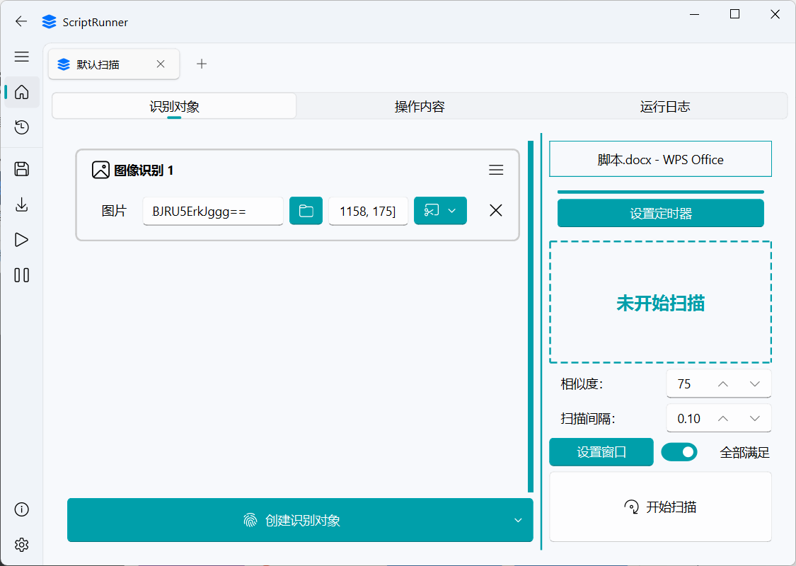
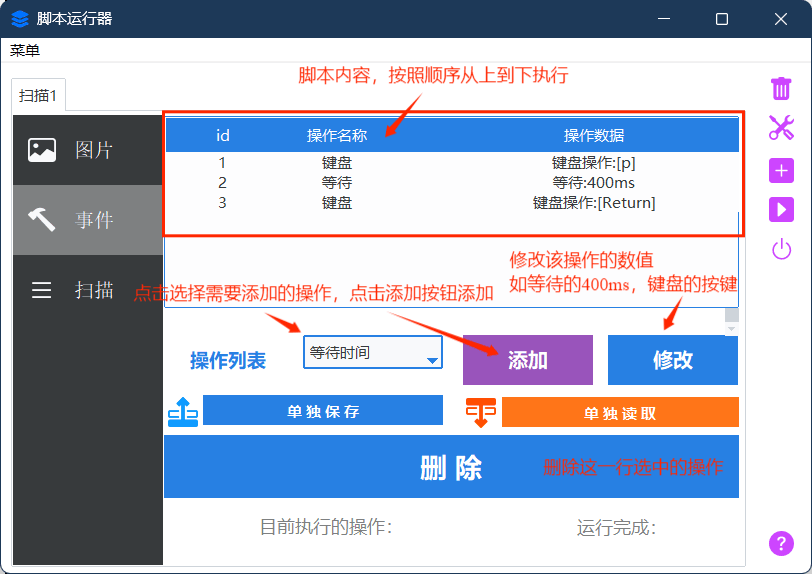
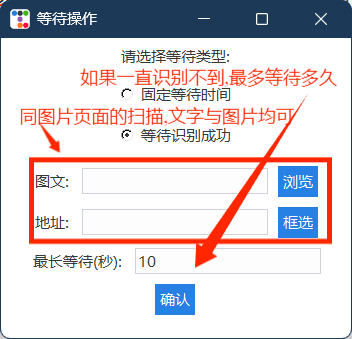
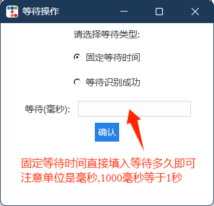
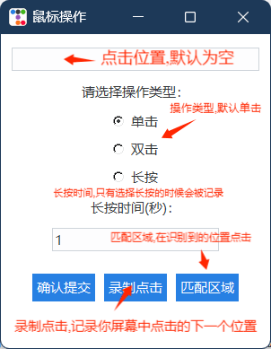
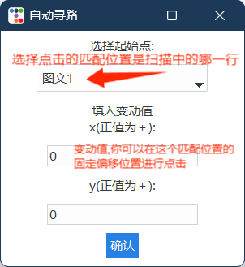
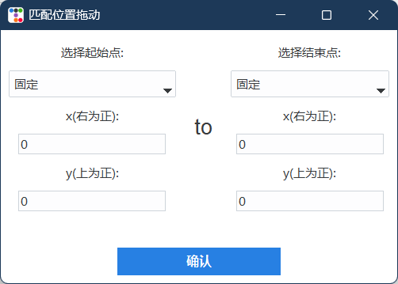
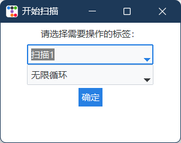
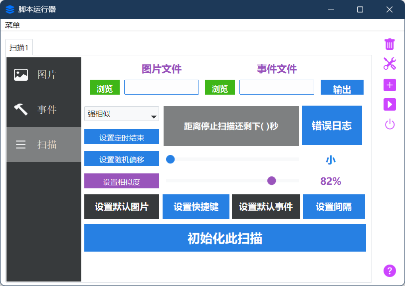
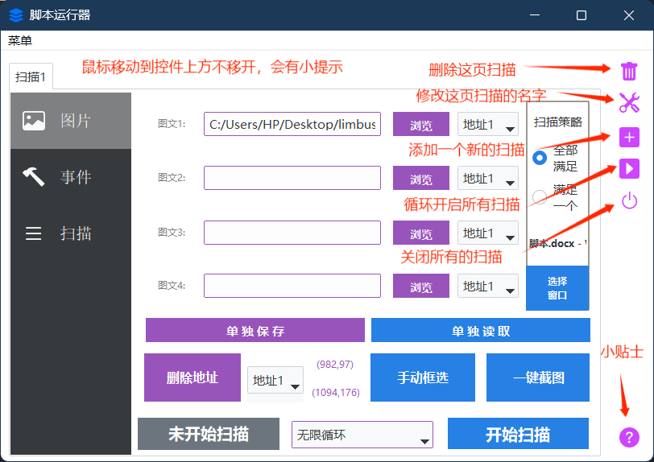

# SCRIPT_RUNNER

### （简单的基于 OpenCV 图像识别的自动化脚本编辑兼运行器） 

    
    

这东西没啥含金量，我拿来打游戏日常的，勉强能用（ ~~代码是到处搬迁学习开源软件的，包括这个readme都是~~ ） 
效果和按键精灵类似(但是按键精灵比我这个强大，如果买过大漠插件，就不需要用我这个，去用按键精灵吧) 

 

 

 

  这是个基于 OpenCV 模式匹配图片识别算法的纯粹的 Python 程序，用 Tkinter 写了个 GUI，所以有图形化界面，不至于是控制台黑漆漆的，小白也操作的来（下一步准备用pyqt美化一下，但是感觉重构代码好麻烦所以一直拖） 

因为作者我的代码能力非常垃圾（软件工程大靴牲特有的代码能力低下），所以写出来的 bug 很多，功能也并不完善。 
但是如果是一些简单的操作，这程序还是有用的罢（存疑） 

它可以在识别特定图片成功后执行模拟鼠标点击、滚轮滚动、键盘输入等操作。 
但目前来说效果一般,真想做到比较复杂操作的话建议去看 MAA（明日方舟助手）,或者是，从那里搞个框架自己写，那个比我做的好太多了，但是我这个虽然功能垃圾,但是好在用起来比较简单不需要编程，截截图就可以实现很多基础的功能。 

<!-- TOC -->
- [SCRIPT_RUNNER](#script_runner)
  - [使用说明](#使用说明)
  - [注意](#注意)
  - [下载方式](#下载方式)
  - [声明](#声明)
  - [致谢](#致谢)
  - [下载源代码](#下载源代码)
  - [最后](#最后)
    <!-- TOC -->

## 使用说明

  
具体使用说明比较长,请点我展开

**一.选择需要识别的对象**

- **图片识别**：点击浏览，填入图片地址,例如【C:/Users/HP/Desktop/limbus/1.jpg】（不包含方括号）；
- **文字识别**：在图片地址的位置输入文字，程序会自动判断是图片识别还是文字识别

---
**二.选择需要识别的区域并且填入**

- **手动框选**：点击后界面变白，用鼠标在一个区域拖动一个区域，和你电脑上的QQ截图类似的效果
- **一键截图**：与手动框选相同的操作，但是会同时将框选内容的图片截图保存下来，并且填入图文1所在的输入框
- **删除地址**：框选识别区域后会自动将该识别地址保存到空地址栏，一共四个地址，如果有不需要的地址，请点击删除地址将该地址变为【0，0，0，0】，如果需要，那么就不用点击这个按钮
- **选择图片所需地址**  在需要识别图片匹配对应的地址，如地址1对应 【982，97，1094，176】的扫描区域 （前两个数字是扫描区域左上角的坐标,后两个数字是右下角的坐标）。如果a图片需要扫描的区域就是这里，那就在a图片填入的输入框（我们这里假设填入的是图文1，也就是第一行）后面的地址栏选择 【地址1】即可让a图片对应的扫描区域正确。

---
**三.其他识别功能（选填）**

- **扫描策略**：默认的扫描策略是 【全部满足】

也就是说如果你 多个地址栏位都填入了内容，例如【图文一 图文二 图文三】 分别填入了 a图片，b图片,c图片，地址分别选择了 地址1 地址2，地址3

那么你必须得满足

1.地址1的位置识别到a图片

2.地址2的位置识别到b图片

3.地址3的位置识别到c图片

三个同时满足，才会执行你设计的脚本，否则不会执行

如果是选择了满足一个，那么这三个要求，只需要满足其中一个即可执行脚本操作

- **选择窗口**：点击后，选择一个你需要脚本运行的窗口，只有在你选择的窗口置顶的情况下才会运行，如果不在的话脚本工具会提示你该窗口未置顶，这个功能主要是防止你一边开着脚本一边和人聊天，突然识别成功运行脚本，抢了你的鼠标和键盘乱动，导致在qq界面发一大堆莫名奇妙的东西出去（老版本的就会导致这个问题,我经常开着和人聊天突然开始乱按p键···）

---
**四.设计脚本内容**

当你设计的图片识别区块正常的时候，就是时候进入到脚本设计环节了。

在图片识别成功（或文字识别）的时候，就会开始执行脚本。

本软件无需用户进行脚本代码的编写，改为给你提供一系列的脚本选项，都是自动化需要用到的鼠标键盘操作，你在这些选项中选择并且自由组合，完成其他脚本工具做到的功能。

目前提供的脚本选项有

#### **1.等待时间**：脚本操作之间的等待时间,也可以选择等待图文识别成功

等待识别成功可以当作成功的判断符号，将执行成功条件的判断条件加入（比如，打开 微信 的成功条件就是 在【头像位置】识别到【微信头像图片】），你就可以判断是否成功执行了，因为如果没成功的话，下一次执行就会拖到很长时间以后

 

#### **2.键盘操作**：按键多按（如ctrl+v的操作），长按，单点，打字

多按:如ctrl+v之类的多个按键同时按下的操作

长按:按住某个按键不放

单点:单次按下某个按键

多按长按:一次性按下多个按键不放下

打字:按顺序输出多个文字，如打字 pinyin  就会输出 pinyin 此时如果你是中文输入法，再按下 空格 （space） 就会打出 拼音了。

当然，打字的输入你可以直接输入中文,软件会自动帮你拆解成拼音的。比如输入 “拼音”  点击确认后会自动帮你变为[(pinyin)]

**注意：**某些情况自动读取会出现问题,建议使用手写输入

例如,如果你想多按 alt+tab 触发了alt+tab切屏,此时自动读取只能读取到alt，因为你按下tab的时候就切页了，切页后的无法读取

这时候就要切换为手写,手动输入 alt+tab 到键中。

但是大多数时候自动读取还是好用的，因为键盘上的特殊按键, 例如control键，每次都要手打也太麻烦了,还要查询怎么拼写,所以键盘操作默认是自动读取的。

#### **3.鼠标操作**：鼠标左键右键中键，长按，单点，双击

通常情况下点击录制点击即可，会将屏幕变白，此时在屏幕上点击你想要点击的位置,录制下点击（注意,左键右键中键都是可以的）

匹配区域则是指，在扫描匹配到的位置进行点击（匹配区域的正中心点），例如：打地鼠游戏，扫描到地鼠，在地鼠的位置点击才能打到地鼠，所以如果你想要点击的位置是不固定的，但是又有相同的特征，请使用此功能！

**注意：**如果匹配区域未被扫描到，点击位置会是 （0，0）

这种情况发生在 这一页你有多个扫描,满足方式选择了【满足一个】。当图文1被识别到，触发满足一个，启动了脚本执行，但是你点击脚本的位置选择是【图文2匹配区域+变动值0/0】 ，显然图文2并没有被识别到，自然图文2的点位会是（0，0）,这就会导致问题出现，所以请确保是在能被识别的点位产生点击

#### 4.**鼠标拖动**：鼠标拖动/滑动  可以画曲线

第一行，是用于选择绘制曲线的方法。第二行用于曲线执行时的方式

绘制轨迹由一连串的点组成，如果是曲线，那么这些点会相当多，如果是直线，就会比较的短。

**录制曲线**：界面同样被白色蒙版覆盖，你可以在上面画出一条曲线或者直线，按下鼠标开始记录，松开鼠标停止记录

注意，录制时间会影响到曲线执行时的总时间，虽然影响效果不大（一条线点太多了，执行效率会被大大拖慢）

**手动输入**：你可以手动输入一条线的起始点到终止点,当然，这里的起始点和终止点都可以选择匹配区域,

比如，你可以将【垃圾.txt】 和 【回收站】添加到图文1 和图文2；创建拖动，选择手动输入，起始点选择【图文1】，结束点选择【图文2】，变动值都填0

那么就可以实现将【垃圾.txt】拖入回收站的操作了，并且不论这两个东西在桌面的什么地方，都可以识别并且自动创建这么一条拖动轨迹将【垃圾.txt】拖入回收站

#### 5.**滚轮**：滚轮操作

滚轮用手指从后向前面滚为正数，从前面往后面滚为负数。滚轮的具体步数你可以直接对着窗口滑动,会记录下你滚动的步数，大致感知以下你需要多少次滚轮步数即可。

#### 6.**开启/关闭扫描**：顾名思义，开启或者关闭某个扫描的功能

有了这个，就可以a扫描成功后关闭b扫描这样子设计了

选择需要操作的标签，选择需要执行的次数（无限循环/1次/10次）

---
**五.设置相似度与扫描间隔等特殊数值**

- **设置相似度**：脚本扫描的相似度阈值，高于这个相似度才会执行，可以拖动滑槽选择数值，图片中的是82%相似度；

- **设置随机偏移**：按键点击之间的随机变动值，让脚本的操作更加的不稳定，像真人

- **设置默认图片/快捷键/默认事件（即默认脚本）**：即每次单开新的扫描页面的默认填入值，注意一下，软件是可以挂托盘运行的哦，在设置快捷键中，关闭方式填入最小化，关闭软件就会将软件最小化到托盘，不影响扫描和操作，对托盘图标右键，就可以彻底关闭啦，但是我的建议是别整，这部分代码可能有bug，没怎么在意这部分代码。

    默认快捷键是esc:关闭所有扫描   和  f11循环开启所有扫描，可以点击设置快捷键按钮去修改

- **设置扫描间隔**：扫描与扫描之间的间隔，默认是100ms

- **设置定时结束**：设置定时定点结束，可以设置100s后结束，或者设置扫描100次后结束，或者设置脚本运行100次后结束

- **初始化扫描**：将当前页面的扫描数据全部初始化，填入默认的图片与脚本

- **错误日志**：即打开错误日志文件夹查看有无报错

------

**六.开始扫描，等待扫描成功后脚本执行**

**1.选择循环次数（默认无限循环）**

无限循环搭配扫描次数限制，你就可以选择定次数结束了

**2.点击开始扫描**

注意左边的未开始扫描的灰色标签，此标签会实时显示目前的情况，当出现问题时也会提醒你

---

## 注意

操作列表里有开始扫描和关闭扫描两个特殊的选项，建议不要一次开启太多扫描  
扫描开启多个，界面可能会卡顿。如果真的需要很多扫描，请使用界面右侧那一堆图标中的播放按钮，那个按钮是轮换扫描按钮，使用那个不怎么会引起卡顿，对应的快捷键是 f11 

快捷关闭所有扫描的快捷键是esc 

因为使用的是比较原始的读取字符串，拆解得到参数，随后进行执行的方式，请注意不要特意的将我设置的标志位填入脚本,否则会导致拆解失败从而运行失败。我常用的标志位为  - || { }  ()  []  【】： : 这几个字符，尽量避免使用这些字符，比如在键盘操作中输入这些字符（虽然问题不大）

**如果无法执行操作，第一步先调低相似度阈值**, 不要设置的太高，尤其是文字识别的阈值，文字识别如果文字本身在一些花里胡哨的背景下，识别的可信度是很低的，很有可能只有百分之五十几。

如果非要在大片区域内寻找内容，首先先考虑文字识别，文字识别的速率比较快（但是第一次启动会有一个小延迟），图片识别的识别速率会随着识别区域的扩大变得相当低下

---

## 下载方式

点击[Realeases](https://github.com/mrmanforgithub/Easy_ScriptRunner/releases)并下载最新版即可，解压后点击 ScriptRunner.exe的蓝色小程序就可以运行啦

---

## 声明

本软件永久开源、免费，仅供学习交流。

请勿使用此软件代练或者是滥用软件，因此产生问题及后果，与本软件和作者无关。

用户在使用过程中需自行遵守相关平台的使用规则与服务条款。因使用本软件可能导致的游戏账号封禁、违规行为等一切后果，作者概不负责。用户需对自身行为负责，并承担使用本软件可能带来的所有风险。

纯离线软件，该软件不会使用网络。

如果出现软件无法正确运行的情况，请提交 [Issue](https://github.com/mrmanforgithub/Easy_ScriptRunner/issues) 。

软件图标素材来源免费的图标库，无任何侵权内容。

---

## 致谢

各项开源项目

各种游戏小助手

paddleocr.json

chatgpt（代码报错出问题了我都问他，你的代码好帮手）和copilot

## 下载源代码

纯构式代码,我的建议是别下载也别学习

---

## 最后

如果软件对你有帮助,请点个星星,顺带帮我测试一下用起来怎么样,有问题记得报告,如果想帮我写或者修改那我也没意见
