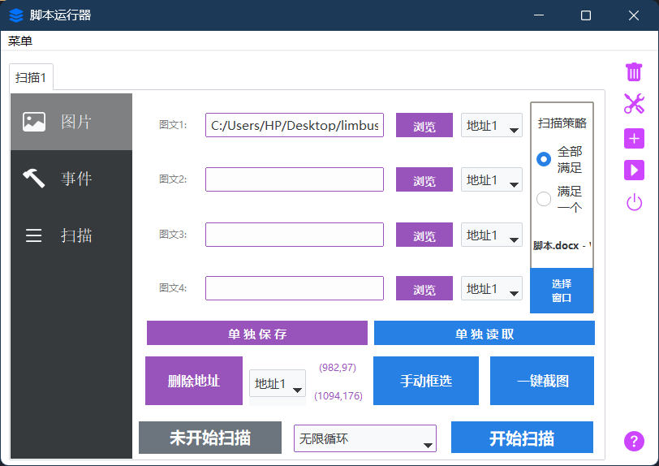
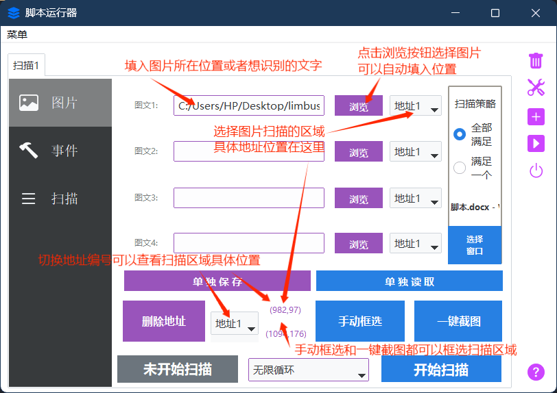
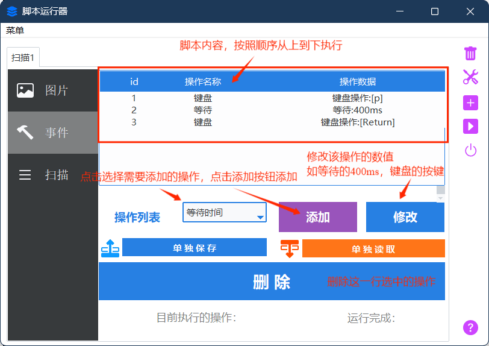
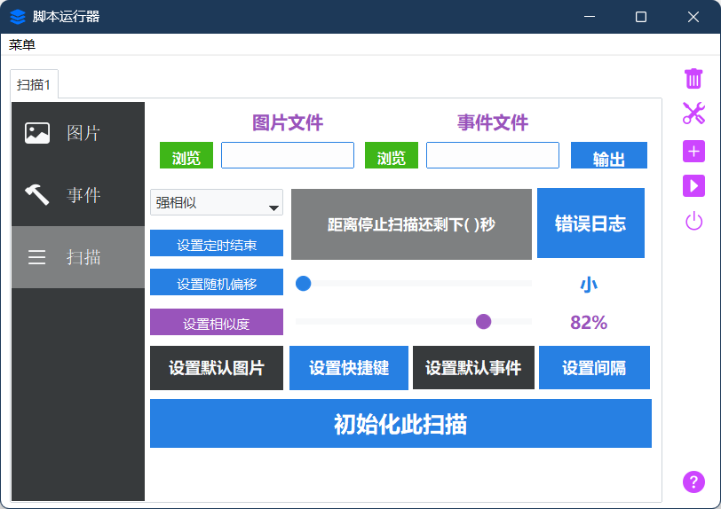
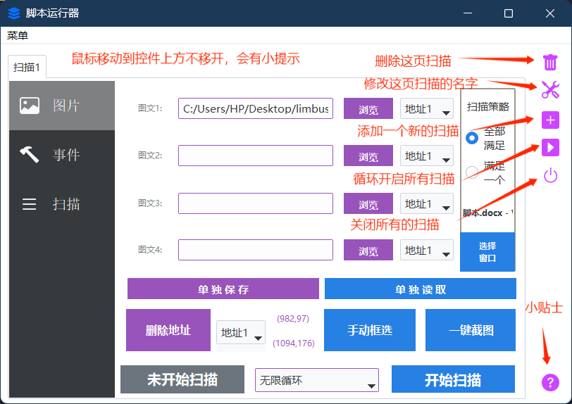

# SCRIPT_RUNNER

### （简单的基于 OpenCV 图像识别的自动化脚本编辑兼运行器） 

    
    

这东西没啥含金量，我拿来打游戏日常的，勉强能用（~~代码是到处搬迁学习开源软件的，包括这个readme都是~~） 
效果和按键精灵类似(但是按键精灵比我这个强大，如果买过大漠插件，就不需要用我这个，去用按键精灵吧) 

优点是：不用写对应游戏的专属代码，只需要会截图就能运行，适合小白一点。 

缺点是：代码写的很构式，纯石山，效率差效果也差

在我的一代基础上，把界面改的好看了一些，并且优化了一些体验和构筑，比起原本的屎山代码来说，现在至少好了一些（~~可能~~） 
 

这是个基于 OpenCV 模式匹配图片识别算法的纯粹的 Python 程序，用 Tkinter 写了个 GUI，所以有图形化界面，不至于是控制台黑漆漆的，小白也操作的来 

因为作者我的代码能力非常垃圾，所以写出来的 bug 很多，功能也并不完善。 
但是如果是一些简单的操作，这程序还是有用的罢（存疑） 

它可以在识别特定图片成功后执行模拟鼠标点击、滚轮滚动、键盘输入等操作，我写这个是为了帮我打游戏的每日日常，也打算让它帮我刷边狱巴士的地牢。 
但目前来说自动打完一整个地牢是比较困难的，真想做到这种操作的话建议去看 MAA（明日方舟助手),或者是，从那里搞个框架自己写，那个比我做的好太多了，还支持 OCR 呢，我这个完全就是一坨稀的，但是我这个比较简单，截截图就可以实现很多基础的功能，还是很简单的吧？ 

<!-- TOC -->
- [SCRIPT_RUNNER](#script_runner)
  - [使用说明](#使用说明)
  - [注意](#注意)
  - [下载方式](#下载方式)
  - [声明](#声明)
  - [致谢](#致谢)
  - [下载源代码](#下载源代码)
  - [最后](#最后)
    <!-- TOC -->

## 使用说明

  
展开

**一.选择需要识别的对象**

- **图片识别**：点击浏览，填入图片地址；
- **文字识别**：在图片地址的位置输入文字，程序会自动选择图片识别

---
**二.选择需要识别的区域并且填入**

- **手动框选**：点击后界面变白，用鼠标在一个区域拖动一个区域，和你电脑上的qq截图类似的效果
- **一键截图**：与手动框选类似，但是会同时将框选内容的图片截图保存下来，并且填入图文一所在的输入框
- **删除地址**：框选识别区域后会自动将该识别地址保存到空地址栏，一共四个地址，如果有不需要的地址，请点击删除地址将该地址变为【0，0，0，0】，如果需要，那么就不用点击这个按钮
- **选择图片所需地址**  在需要识别图片匹配对应的地址，如地址1对应 【982，97，1094，176】的扫描区域，并且a图片需要扫描的区域就是这里，那就在a图片填入的输入框，我们这里假设填入的是图文一，也就是第一行，第一行后面的地址栏选择 【地址1】即可让a图片对应的扫描区域正确。

---
**三.其他识别功能（选填）**

- **扫描策略**：默认的扫描策略是 【全部满足】

也就是说如果你 多个地址栏位都填入了内容，例如【图文一 图文二 图文三】 分别填入了 a图片，b图片,c图片，地址分别选择了 地址1 地址2，地址3

那么你必须得满足

1.地址1的位置识别到a图片

2.地址2的位置识别到b图片

3.地址3的位置识别到c图片

三个同时满足，才会执行你设计的脚本，否则不会执行

如果是选择了满足一个，那么这三个要求，只需要满足其中一个即可执行脚本操作

- **选择窗口**：点击后，选择一个你需要脚本运行的窗口，只有在你选择的窗口下才会运行，如果不在的话脚本工具会提示你该窗口未置顶，这个功能主要是防止你一边开着脚本一边和人聊天，突然识别成功运行脚本，抢了你的鼠标和键盘乱动，导致在qq界面发一大堆莫名奇妙的东西出去

---
**四.设计脚本内容**

当你设计的图片识别区块正常的时候，就是时候进入到脚本设计环节了。

在图片识别成功（或文字识别）的时候，就会开始执行脚本。

本软件无需用户进行脚本代码的编写，改为给你提供一系列的脚本选项，都是自动化需要用到的鼠标键盘操作，你在这些选项中选择并且自由组合，完成其他脚本工具做到的功能。

目前提供的脚本选项有

- **等待时间**：脚本操作之间的等待时间；
- **键盘操作**：按键连按（如ctrl+v的操作），长按，单点
- **鼠标操作**：鼠标左键右键中键，长按，单点，双击
- **鼠标拖动**：鼠标拖动/滑动  可以画曲线
- **滚轮**：滚轮操作
- **自动寻路**：不再选择固定点位进行点击，选择识别点位进行点击(比如识别到地鼠,但是地鼠从哪个洞出来位置不确定,需要选择这个功能对识别到地鼠的区域进行打地鼠这种操作,注意,新版本该功能被移除,被添加到了鼠标操作内部,点击鼠标操作内部的‘匹配区域’)
- **开启/关闭扫描**：顾名思义，开启或者关闭某个扫描的功能，有了这个，就可以a扫描成功后关闭b扫描这样子设计了

---
**五.设置相似度与扫描间隔等特殊数值**

- **设置相似度**：脚本扫描的相似度阈值，高于这个相似度才会执行，可以拖动滑槽选择数值，图片中的是82%相似度；

- **设置随机偏移**：按键点击之间的随机变动值，让脚本的操作更加的不稳定，像真人

- **设置默认图片/快捷键/默认事件（即默认脚本）**：即每次单开新的扫描页面的默认填入值，注意一下，软件是可以挂托盘运行的哦，在设置快捷键中，关闭方式填入最小化，关闭软件就会将软件最小化到托盘，不影响扫描和操作，对托盘图标右键，就可以彻底关闭啦，但是我的建议是别整，这部分代码可能有bug，没怎么在意这部分代码。

    默认快捷键是esc:关闭所有扫描   和  f12循环开启所有扫描，可以点击设置快捷键按钮去修改

- **设置扫描间隔**：扫描与扫描之间的间隔，默认是100ms

- **设置定时结束**：设置定时定点结束，可以设置100s后结束，或者设置扫描100次后结束，或者设置脚本运行100次后结束

- **初始化扫描**：将当前页面的扫描数据全部初始化，填入默认的图片与脚本

- **错误日志**：即打开错误日志文件夹查看有无报错

------

**六.开始扫描，等待扫描成功后脚本执行**

**1.选择循环次数（无限循环）**

**2.点击开始扫描**

---

## 注意

操作列表里有开始扫描和关闭扫描两个特殊的选项，建议不要一次开启太多扫描  
扫描开启多个，界面会开始卡顿。如果真的需要很多扫描，请使用界面右侧那一堆图标中的播放按钮，那个按钮是轮换扫描按钮，使用那个不怎么会引起卡顿，对应的快捷键是 f12 

快捷关闭所有扫描的快捷键是esc 

---

## 下载方式

点击[Realeases](https://github.com/mrmanforgithub/Easy_ScriptRunner/releases)并下载最新版即可，解压后点击 ScriptRunner.exe的蓝色小程序就可以运行啦

---

## 声明

本软件永久开源、免费，仅供学习交流。

请勿使用此软件代练或者是滥用软件，因此产生问题及后果，与本软件和作者无关。

用户在使用过程中需自行遵守相关平台的使用规则与服务条款。因使用本软件可能导致的游戏账号封禁、违规行为等一切后果，作者概不负责。用户需对自身行为负责，并承担使用本软件可能带来的所有风险。

纯离线软件，该软件不会使用网络。

如果出现软件无法正确运行的情况，请提交 [Issue](https://github.com/mrmanforgithub/Easy_ScriptRunner/issues) 。

软件图标素材来源免费的图标库，无任何侵权内容。

---

## 致谢

各项开源项目

各种游戏小助手

paddleocr.json

chatgpt（代码报错出问题了我都问他，你的代码好帮手）和copilot

## 下载源代码

- 纯构式代码,我的建议是别下载也别学习

---

## 最后

如果软件对你有帮助,请点个星星,顺带帮我测试一下用起来怎么样,有问题记得报告,如果想帮我写或者修改那我也没意见
