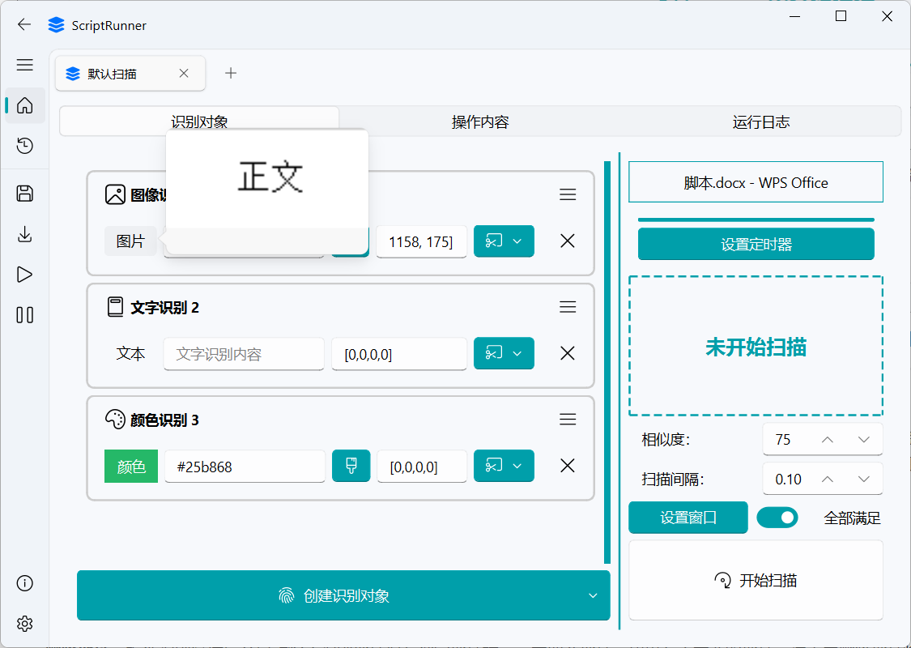
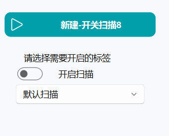

# SCRIPT_RUNNER

### （简单的基于 OpenCV 图像识别的自动化脚本编辑兼运行器） 

    
    

这东西没啥含金量，我拿来打游戏日常的，勉强能用（~~代码是到处搬迁学习开源软件的，包括这个readme都是~~） 
效果和按键精灵类似(但是按键精灵比我这个强大，如果买过大漠插件，就不需要用我这个，去用按键精灵吧) 

 

 

 

  这是个基于 OpenCV 模式匹配图片识别算法的纯粹的 Python 程序，用 PyQt重构了之前的 GUI，有图形化界面，不至于是控制台黑漆漆的，小白也操作的来（至少我室友在我教导下几分钟就可以用软件写个自动玩谷歌小恐龙的脚本了） 

因为作者我的代码能力非常垃圾（软件工程大靴牲特有的代码能力低下），所以写出来的 bug 很多，功能也并不完善。 
但是如果是一些简单的操作，这程序还是有用的罢（存疑） 

它可以在识别特定图片成功后执行模拟鼠标点击、滚轮滚动、键盘输入等操作。 
但目前来说效果一般,真想做到比较复杂操作的话建议去看 MAA（明日方舟助手）,或者是，从那里搞个框架自己写，那个比我做的好太多了，但是我这个虽然功能垃圾,但是好在用起来比较简单不需要编程，截截图就可以实现很多基础的功能。 

<!-- TOC -->
- [SCRIPT_RUNNER](#script_runner)
  - [使用说明](#使用说明)
  - [注意](#注意)
  - [下载方式](#下载方式)
  - [声明](#声明)
  - [致谢](#致谢)
  - [下载源代码](#下载源代码)
  - [最后](#最后)
    <!-- TOC -->

## 使用说明

  
具体使用说明比较长,请点我展开

### **第1步.添加识别对象**

- **创建识别对象**：点击下方创建识别对象按钮，选择识别对象类型，当前包括【图像识别，文字识别，颜色识别，必定成功】；

这个包含 图标 名字，删除按键和菜单按键的部分被称为识别对象。如果你没有其他高级设置，请跳至第2步。

- **修改识别对象名称**：双击这个【图像识别1】即可修改这个名字，允许重复。新建的默认名称都是【类名+序号】

- **删除识别对象**：当你不再需要这个【图像识别1】了，你可以点击右下角的【X】按钮，删除此识别对象

- **菜单与其他功能**：右键打开菜单，或者点击识别对象右上角的三条横线打开菜单，效果一致。

  菜单内容包括 【上移/下移识别对象，删除识别对象，调试执行识别，识别并显示区域】

  其中上移/下移为字面意思，将识别对象向上移动/向下移动，不影响实际使用

  删除识别对象已经介绍过了。

  调试执行识别：针对这个识别对象进行一次单独的识别，并且告诉你识别成功与否，比如文字识别对象此处就会执行一次文字识别。

  识别并显示区域：在调试执行的基础上，将识别到的区域结果显示出来。

此时你已经创建了一个识别对象，可以进行到第2步了。

---

### **第2步.填写识别内容和识别参数**

- **识别内容**：你想要识别什么，要自动打地鼠就需要找到地鼠，所以你需要地鼠的图片，并把地鼠图片的路径填写进识别内容框。（未说明的情况下是左边的输入框，即上张图片中内容为【BJRU5E···】的文本框。此处内容并非路径而是Base64编码的图片，如果你也想用编码替代图片路径，请到设置中启用Base64，但默认情况你需要填写图片路径，例如【C:/Users/HP/Desktop/limbus/1.jpg】不包含方括号）

- **高级设置**：图像识别中，图片两个字鼠标移动上去会预览此图片内容；颜色识别中的颜色两个字会预览颜色；文字识别识别内容支持正则表达式，用re()包裹的内容被视为正则表达式。

  **辅助工具**：图片识别文本框右侧 文件夹图标的按钮，点击即可打开文件浏览器，选择图片把路径加入（如果开启了Base64则加入的是编码过后的图片）；颜色识别文本框右侧 刷子图标的按钮，点击可以打开取色器（效果如下图），单击取得鼠标指针下面的颜色并退出取色器。

- **识别地址**：你想要在哪里找到，比如你要在屏幕中间找到，那就输入对应的区域的坐标[x1,y1,x2,y2]，对应的文本框为上图中内容为【1158，175]】的文本框。
- **识别地址工具**：地址文本框右侧，剪刀图标的按钮，点击即可打开工具菜单，菜单包括【框选区域，一键截图，显示区域】，在颜色识别中仅有【框选区域，显示区域】，文字识别中为【框选区域，文字识别，显示区域】。

  框选区域：即为QQ截图效果，手动拖拽一个区域，将这个区域的坐标转化为文字并且填入识别地址文本框。

  一键截图：则是在框选的基础上，多了一步将框选范围内容截图保存为图片的步骤（如果你启用Base64则不会保存为png），并且将坐标和图片两者分别填入识别地址文本框与识别内容文本框。

  显示区域：根据识别地址文本框的内容，显示当前的框选范围，单击左键退出显示。可以用来验证是否区域正确。

  文字识别：在框选区域的基础上，多了一步将框选内容图片进行文字识别的步骤，并将文字识别结果填入识别内容文本框。【当你懒得打字的时候会有用，但是文字识别可能出错，不要百分百相信】

​    **注意**：识别地址文本框内容不允许出现【0，0，0，0】，因为这个识别区域是无效的识别区域，所以软件会告诉你识别地址不能为空。

现在你向之前创建的识别对象中分别输入识别内容和识别地址，可以进行到第三步了。

---

### **第3步.其他识别参数（选填）**

- **扫描策略**：默认的扫描策略是 【全部满足】

也就是说如果你 多个识别对象都填入了内容，例如【图像识别一 图像识别二 图像识别三】 分别填入了 a图片，b图片,c图片，地址分别填入了 地址1 地址2，地址3

那么你必须得：

1.地址1的位置识别到a图片

2.地址2的位置识别到b图片

3.地址3的位置识别到c图片

三个同时满足，才会执行你设计的脚本，否则不会执行。

如果策略选择满足一个，那么这三个要求，只需要满足其中一个即可执行脚本操作

- **设置窗口**：设置窗口按键就在开始扫描按钮上方，点击后，选择一个你需要脚本运行的窗口，只有在你选择的窗口置顶的情况下才会运行，如果不在的话脚本工具会提示你该窗口未置顶。

  这个功能主要是防止你一边开着脚本一边和人聊天，突然识别成功运行了脚本，抢了你的鼠标和键盘乱动，导致在qq界面发一大堆莫名奇妙的东西出去。

- **设置定时器**：设置定时器按键在右边面板的上方，点击后，选择你要定时还是定扫描次数 或者定执行次数，输入数字，在下次开始扫描后就会按照这个次数计时，倒计时结束后会自动停止扫描。

- **设置相似度与扫描间隔**：字面意思理解，相似度为识别成功的判断阈值，不要设置的过高或者过低，文字识别在花里胡哨的背景下的可信度是比较低的，相似度设置过高可能出现判断一直失败的情况。

  扫描间隔则是两次扫描的相对间隔时间，不是两次扫描的绝对间隔时间，因为扫描和执行两个操作都是耗时的，真正的间隔会更长一点。

现在你已经设置好这些琐碎的其他扫描设置了，可以进行到第4步了（如果你没有这方面的需求，其实第3步是可以直接跳过的）

---

### **第4步.设计脚本内容**

当你的识别对象创建并且完整填入参数后，就是时候进入到脚本设计环节了。

在识别成功，满足识别策略的时候，就会开始执行你在此处设置的脚本。

本软件无需用户进行脚本代码的编写，改为给你提供一系列的选项，进行参数填写。然后把参数转化为执行的数据。

先来介绍这个页面，页面的左上部分横条是操作条，包括【添加，删除，修改，上移，下移，录制，复制，执行，获取参数，全选】

页面的左下部分是操作表单，按照表单从上到下的顺序执行里面定义的行为。点击其中的一行数据，就会在右侧操作详情界面显示这行数据的参数填写情况。

页面的右边是操作详情界面，主要用于在这个页面填入参数并且点击提交，提交过后显示在操作表格中。

先介绍一下操作横条：

#### **1.添加**

添加操作很简单，就是往里面添加各种类型的操作，目前包含的操作种类有【等待，鼠标，键盘，滚轮，拖动，命令，开启/关闭】

##### **（1）.等待时间**

脚本操作之间的等待时间，下面给出的截图为完整截图，后续均改为右侧详情界面的截图

**开始计时**：按钮点击后就会进行计时，底下的数字单位为毫秒。输入满意的数字后即可提交

##### **（2）.检查匹配**

用于实现IF-ELSE效果的操作。

可以选择图像识别，文字识别，颜色··等识别对象中存在的识别。并且在此处进行一次验证。

【例如：操作1为双击，意图打开QQ；操作2为检查匹配，在头像处进行图像识别，检查是否存在自己的头像，如果识别成功代表着缺失打开了QQ，继续后续操作，如果失败了则代表着打开QQ失败了，跳过后续操作并重新尝试执行操作1打开QQ】

**高级配置**：各种识别的高级配置同第1步说的那些识别对象（如文本可以使用正则），注意此处的地址可以使用【动态参数】，即可以将动态的参数填入，此处的（1，0，0，3） 即为动态参数，如何获得动态参数请翻阅后续的获取参数步骤，动态参数使用普通括号包裹，固定地址使用[100,200,200,400]这样的方括号包裹，请不要误用。

 **【动态参数】**：一种根据识别结果变动的参数，例如识别打地鼠，动态参数就是地鼠的位置，因为这个位置是变动的，可以出现在各个地方。动态参数一般由四个字符组成（a,b,c,d），第一部分a是标识符，代表参数来源与a号识别；第二部分为x方向的变动值，代表参数要在x上加上b；第三部分是c代表y方向上的变动值，代表了要在y方向上加上c；第四部分是参数类型，d代表了参数是d类型，这里的（1，0，0，3）则代表了1号识别的 完整匹配区域（3代表完整匹配区域） 在x上无变动，在y上无变动 的一个动态地址。

**最长等待时间**：会持续识别这么久，如果均未识别成功则判断为识别失败。

**如果成功**：可以选择继续/跳过后续/跳过n个步骤，均为字面意思。通过继续和跳过，即可实现if和else的效果

**如果失败**：同上

二者共同组成了逻辑判断单元。

##### **（3）.鼠标操作**

鼠标左键，右键，中键，长按，单点，双击 两两组合

**连点次数**：点击的次数根据此处数字决定，当然双击其实本质上就是连点次数为2的单击。

**长按时间**：当选择了长按的时候，连点次数会改为长按时间，此时输入的数据被记录为鼠标按下的时间。

**录制点击**：打开录制点击窗口蒙版，此时在屏幕上点击你想要点击的位置,录制下点击的坐标。

**匹配区域**：获取 **【动态参数】**用的组件，点击后会给你一个选项卡，根据你的选项反向获得动态参数字符串，如（1，0，0，0），此处第四部分0代表了 匹配区域中心点。亦可以选择当前鼠标位置，（0，0，0，0）代表了当前鼠标坐标的动态参数字符串。所以当你需要点击动态区域的时候，请点击匹配区域按钮

**注意：**如果匹配区域未被扫描到，点击位置会是 （0，0），导致错误，所以如果你需要使用动态参数的时候，请确保那个动态参数可以识别到并且有对应值。

例如： 你添加了多个识别对象, 选择了【满足一个】。当图像识别1识别成功，图像识别2识别失败，但因为选择的是【满足一个】，所以依然启动了脚本执行，此时当鼠标点击的位置选择是【图像识别2 匹配区域中心点+变动值0/0】即 （2，0，0，0）这个动态参数字符串 的时候，自然（2，0，0，0）什么都无法得到 , 所以请确保只选择能被识别到的情况进行动态参数读取，又或者你添加一个检查匹配操作进行判断

##### **（3）.键盘操作**

按键多按（如ctrl+v的操作），长按，单点，打字

**多按**:如ctrl+v之类的多个按键同时按下的操作

**长按**:按住某个按键不放

**单点**:单次按下某个按键

**多按长按**:一次性按下多个按键，并且保持长按

**打字**:按顺序输出多个文字，如打字 pinyin  就会输出 pinyin 此时如果你是中文输入法，再按下 空格 （space） 就会打出 【拼音】中文了。

当然，打字的输入你可以直接输入中文,软件会使用复制黏贴的方法帮你直接打出中文字符。

**自动输入**：读取此时用户输入的按键，并将其显示在文本框里，例如按下ctrl键，会显示ctrl在文本框。也可以切换为手动输入自己打出c,t,r,l 就是会有些麻烦

**打字时间**：当你选择了长按或者多按长按后，会显示出来打字时间文本框，输入数字代表了键盘按下的时间

**注意：**某些情况自动读取会出现问题,建议使用手写输入，比如打字。

**高级配置**：当选择了打字模式的时候，会出现匹配文字的按钮，此处依然是获取 **【动态参数】**用的组件。根据你的选择，帮你生成对应的动态参数字符串。

文本相关的字符串此处改用[]方括号包括，[a,b,c,d]依然不变，b和c分别为文字的前缀和后缀。

当a为负数，比如图中的a 为-1 代表的则不是识别对象，而是操作对象，将其取反为1 ，即第一个操作

d为1代表了文字识别结果。

则此处的 (-1,,,1)代表了 操作表格中的第一个操作 的文本识别结果，前缀为空，后缀也为空的一个字符串

使用打字将其打出来(图中是方括号，方括号是错误的，应该是英文圆括号包括的才被正确视为动态参数)。

##### **（4）.鼠标拖动**

鼠标拖动/滑动  可以画曲线

第一行，是用于选择绘制曲线的方法（是直线还是曲线）。第二行用于曲线执行时的方式（是拖动还是移动）

**录制曲线**：界面同样被蒙版覆盖，你可以在上面画出一条曲线或者直线，按下鼠标开始记录，松开鼠标停止记录

注意，录制时间会影响到曲线执行时的总时间，你也可以自己修改拖动时间。

**手动输入**：你可以手动输入一条线的起始点到终止点,当然，这里的起始点和终止点都可以选择 **【动态参数】**,

比如，你可以将【垃圾.txt】 和 【回收站】添加到图像识别1 和图像识别2；创建拖动，选择手动输入，起始点选择【图像识别1】的匹配区域中心，结束点选择【图像识别2】的匹配区域中心，变动值都填0

那么就可以实现将【垃圾.txt】拖入回收站的操作了，并且不论这两个东西在桌面的什么地方，都可以识别并且自动创建这么一条直线拖动轨迹将【垃圾.txt】拖入回收站

**拖动时间**：你可以自己更改，单位为秒。 录制曲线的时候会记录你画线的时间。曲线的绘制是均速的，并不会记录你的完整拖动速率。

##### （5）.**滚轮**操作

**滚轮操作**：滚轮用手指从后向前面滚为正数，从前面往后面滚为负数。滚轮的具体步数你可以直接对着窗口滑动,会记录下你滚动的步数，大致感知以下你需要多少次滚轮步数即可。

##### （6）.**程序命令**

主要是进行文件的启动，文件的关闭，cmd指令和软件内部定义的一些指令

**启动程序**：输入程序的路径，需要是可执行的文件（电脑上有默认执行这种类型文件的软件），比如exe结尾，或者txt，MP3这种可以被启动的文件。【有自动补全机制，输入对应的c:\会自动帮你读取对应路径，并且提示你里面有什么。】

又或者是网站地址，比如：www.bilibili.com 这种网址。

执行后会帮你打开这个文件，如果是网址，会用你电脑的默认浏览器打开这个网址。当然要满足协议的网址，某些特定协议不支持，比如 chrome://dino 这个谷歌小恐龙游戏网站就是无法被启动的，因为chrome这个协议不被支持。

**关闭程序**：同理输入程序的可执行文件的路径，或者是正在打开的文件的名称。会在线程中帮你找到正在运行的这个东西，并且试图帮你终结这个程序的运行。

**系统命令**：cmd命令，我帮你们总结了大部分的cmd命令放进了这里面，有自动补全效果。用这里的命令行，你可以实现cmd实现的单行效果，比如创建文件夹，删除某个东西，电脑关机之类的效果，当然这个效果仅限于windows系统可以使用。

**软件命令**：我定义的一些乱七八糟的特殊函数，你可以在这里输入函数名称来使用这个函数，我目前只开放了两个函数：

1.window_show_top(window_name)  【把窗口名称替换掉这个window_name 不需要双引号】，就会帮你把名字相同的窗口置顶，放到界面最前面来。比如window_show_top(QQ)就是把QQ直接置顶。（前提是你打开了qq，不然找不到QQ就没法置顶哦）

2.figure(expression)  【把expression换成一串算数字符串，也不需要双引号】 效果就是计算这个算术式，并且返回结果。

注意，这里的expression可以使用**【动态参数】**，同时返回的计算结果可以被当作 **【动态参数】** 使用！此处的动态参数同理也是（a,b,c,d）

例如：你可以把文字识别结果传进figure，然后把计算的结果传入键盘打字打出来，可以实现自动计算器的效果。

##### （7）.**开启/关闭扫描**

顾名思义，开启或者关闭某个扫描的功能

有了这个，就可以a扫描成功后关闭b扫描这样子设计了

#### **2.删除操作**

删除操作，选中想要删除的行，点击上方操作条的删除即可删除。

或者右键想要删除的行，打开右键菜单，选择删除即可。

**【注意】**：删除操作可以选择多个操作同时删除，操作表单可以直接ctrl+a实现全选，然后再删除就可以一次性删除全部

#### **3.修改操作**

先选中想要修改的操作（左键点击那一行），然后在右边修改参数。此时提交按钮是灰色的（不允许提交），点击上方操作条的【修改】按钮，修改按钮亮起代表正确，此时可以提交，点击提交就会修改参数成功。

但是这种情况会默认修改为相同类别的操作，如果你想要将【操作a】修改为【操作b】，请使用右键，右键菜单中的修改可以更改此处的操作为其他操作。

或者你可以用比较原始的删掉，然后添加的方式修改操作，也没有问题。

#### 4.上移下移

先选中想要修改的操作（左键点击那一行），然后点击上方操作条的【上移/下移】，即可移动此操作到上一条/下一条。但是注意，第一条操作无法上移动，最后一条操作无法下移。且无法选择多条操作实现共同上移/下移。

上下移动也可以使用右键菜单操作，并不是一定要用上方操作条。

#### 5.录制

添加操作并不是那么的友好，选择各种各样的操作，填写很多参数显然让人头昏眼花，这个时候录制操作就会有很大的帮助！

如果你需要进行的操作没有那么复杂，也没有很多逻辑，你只需要重复的固定的操作（例如自动弹钢琴，不需要识别什么，只需要在固定时间按下固定按键就行，但是按键很多，都自己设置就会累个半死）

这个时候你就需要用到录制功能。

功能很简单，点击录制功能，会跳出一个弹窗，图如下。

从左往右，左边第一个按钮是【锁定置顶】，即这个弹窗是否被固定在屏幕最顶端。默认开启即为锁定在最顶端。

第二个按钮是【记录鼠标移动】，启动后会记录鼠标的每一次移动，不论其是否有意义，启动会大幅的增加录制的操作数量，但是会更加模仿你的操作。

开启录制，默认快捷键为 F10

暂停录制，默认快捷键为F11

结束录制，默认快捷键为F12

点击结束录制就会提交并且更新操作表单，会将你在开启录制期间的操作全都转变为操作数据提交。

目前支持【鼠标操作，键盘操作，鼠标滚动，鼠标拖动，等待时间】这几种，自动帮你转化，不会有太大的误差。你可以自己调整一下录制出来的结果。

**注意**：不要在长按鼠标的同时进行键盘操作，同理反之不要在长按键盘的时候鼠标操作！

当前软件不支持同时执行两个操作，这种情况下很显然会录制出错，得到不符合预期的录制操作结果。

#### 6.复制

复制：将选中的操作复制并且添加到表单的最后

**注意：**复制操作允许选中多个操作复制，且也拥有右键菜单选项

#### 7.执行

调试执行选中的步骤，因为是隔离出来单独执行的，所以缺点是不能直观的获得整体的运行情况，但是可以用于测试这个步骤是否有效。

选中对应的操作，然后点击执行即可

**注意**：执行操作存在于右键菜单中，可以用右键选中直接执行

#### 8.获取参数

**【动态参数】**虽然我在很多地方都设置了可以直接获得动态参数字符串的控件，但是还是需要一个额外的能够生成参数的东西帮助用户获得，或者说是翻译动态参数，所以获取参数功能就诞生了。

第一行的第一个文本框为获取到的变动参数，右侧为是否启用反向翻译（默认是启动的）

当启用了反向翻译后，你可以将 (1,0,0,0)输入这个文本框，窗口会自动调整下面的内容为 [图像识别1  区域坐标中心  x=0 y=0]的情况，告诉你这个动态参数字符串代表的含义是什么。

你也可以手动调整下面的内容，会根据你选择的内容返回动态参数字符串，这两者是双向绑定的。

#### **9.全选**

字面意思，其实ctrl+a也可全选，这个就是做做样子的按键

---

### **第5步.检查运行日志（可选）**

- **运行日志**：是这个页面中的识别过程的运行日志，当出现错误的时候，首先是界面会出现错误，其次是运行日志中可能找到报错原因，第三可能在错误日志文件夹中找到错误。如果三个都没找到错误，但是又实打实的出现错误了，那么说明软件遇到bug了，请通知作者我进行修复。

运行日志的实时更新可能会影响软件的效率导致卡顿，所以我推荐你除非真的想看，可以去设置界面里面把这个东西关掉不进行更新。这里可以显示一个操作的执行时间，什么时候开始的，成功了还是失败了。

蓝色：操作执行成功，

绿色：识别成功，

红色：识别失败，或者出现错误，方便你一眼找到哪里出错了。

橙色：警告，或者目标窗口未置顶，

紫色：启动，或者关闭了扫描

------

### **第6步.开始扫描**

**1.点击开始扫描**

注意右下角的开始扫描的按钮，点击后开始扫描，开始扫描后，那个巨大的未开始扫描的标签的颜色会发生变化，请根据那个标签变化来判断当前情况，比如下图中的这种情况即为开始扫描的情况。【当然目标窗口未置顶是不对的】

**2.侧边栏与快捷键**：鼠标移动到开始扫描的按钮上面，会出现小标签显示默认的快捷键，默认的快捷键是 alt+o 开始扫描，alt+p停止扫描。

侧边栏则是一些特殊的按钮，包括【扫描主页，最近打开，保存扫描，读取扫描，开始扫描，停止扫描，软件信息，设置】

这里主要介绍里面的开始和停止扫描。

这里的开始停止与按钮不同，按钮的开始停止扫描只针对这一页面的扫描，而侧边栏的开始/停止扫描针对的是全部扫描页面的开始与停止。

开始全部扫描：将所有页面同时开始扫描

循环扫描：一个页面一个页面的执行扫描，每个扫描执行一次随后关闭并且执行下一个页面的扫描【注意，目前这样频繁的启动关闭扫描会导致软件崩溃，占用资源，所以不推荐用。】

停止扫描：停止所有页面的扫描，停止循环扫描【注意只有这个按键可以停下循环扫描，单个页面的关闭扫描按钮是停不下来的！】

------

### **第7步.保存与读取**

正常来说，一整个识别页面的识别对象，脚本内容都是需要时间进行编写的，自然不可能是一次性用品，需要保存下来。

这里选择将内容保存为json文件。保存的按钮则放在了侧边栏，具体侧边栏示意图见上一张图。

点击保存，然后选择保存位置和保存的文件名称即可，会将当前软件中所有的扫描页面都保存进去，不存在单页保存。

点击读取，选择【添置读取/覆盖读取】中的一个，前者是额外添加的页面，后者是先删除所有的页面，再添加进来的读取方法。

随后会为你打开文件浏览器，选择对应的json文件就能读取。

**注意：**你可以选择直接将json文件拖入扫描主页，拖进去会直接读取哦

------

### **第8步.最近打开**

最近打开用于帮助用户快捷的打开最近打开过的脚本，不用再一个个去找了。

选择想要打开的脚本，点击打开即可实现快捷打开。

如果不想在最近打开中看到这个，可以直接点击清除删掉这个记录。

------

### **第9步.设置**

软件的各种细节设置

**脚本文件夹**：脚本默认保存和读取的文件夹，读取图片也会默认尝试从这里读取

**下载文件夹**：更新安装包下载到的文件夹

**默认扫描页**：软件启动的时候默认自带的扫描页面，可以点击自定义页面去自定义这个默认页面

**默认新建页**：软件点击新建后新建出来的扫描页面，可以点击自定义页面去自定义这个默认页面

**默认快捷键**：修改软件启动和关闭扫描的快捷键

**随机偏移**：鼠标点击的随即偏移，px为单位

**图像识别**：图像识别的具体方法，可以选择 模板匹配/特征识别

**启用Base64**：是否将图片改用Base64的方式存储，好处是可以不需要保存图片，并且传递脚本更加简单

**运行日志**：运行日志的记录方式，存在【记录全部日志，记录非重复日志，不记录日志】

**最小化到托盘**：软件是否会最小化到托盘，最小化的同时也能够进行识别

**云母效果**：软件界面是否半透明

**应用主题**：是明亮主题还是黑暗主题

**主题色**：软件各种按钮的颜色

**界面缩放**：界面的缩放比例

**语言**：选择是跟随系统/简体中文/英文

**应用启动时启用更新**：启动时会进行更新检查，你首先需要有能连接上github的网络环境，不然检测肯定会失败哦

**下载预发布版本**：是否下载预发布的版本，其实没用，因为我不会发布预发布版本

**帮助**：就是帮你打开这个Readme

**提供反馈**：去github给我反馈一下bug

**查看错误日志**：打开错误日志文件夹，看看出了什么错？

**关于**：这里可以看到当前的版本信息，也可以手动更新哦

------

### **第10步.模组**

觉得作者写的识别函数，作者写的操作函数太low了？识别效果太差？不符合你的心意？ 没有问题——如果你的编程能力足够的话，你可以用模组解决这个问题。

软件根目录下面的app文件夹，打开后你会发现有一个空的mod文件夹。

按照我给出的规则，满足内容，就可以自己定义自己的识别函数和界面组件，也可以用自己训练出来的模型进行判断。

首先，针对于识别对象

需要遵循：

**1.第一行 声明mod类型为识别器**

MOD_TYPE: recognizer

**2.需要使用绝对路径而非相对路径导入软件定义的类和方法**

  from app.common.photo_tool import photo_tool

​    非软件定义的类和方法，你可以自由导入包

**3.需要注册器注册为对应的类型，不允许重复名称**

注册器从  from app.common.recognizer_registry import register_recognizer 导入

   @register_recognizer("模板匹配", FluentIcon.PHOTO,  compare_images_with_template_matching)

  class TemlplateWidget(QWidget):····

这个类必须以 QWidget为基底（最底层需要是这个）

必须拥有

   self.line_edit = LineEdit(self)

   self.address_edit = LineEdit(self)

   这两个控件（名称必须一致），分别代表着识别内容 和 识别区域

   可以设置为不可见，设置为不可见的前提是你需要给这两个框赋值，这两个框不能内容为空，不然会出错

**4.需要一个识别函数（名字自己定义，参数参考如下），识别函数需要和注册器里写的那个是同一个函数。**

 compare_images_with_template_matching(parent, target, address_content, chosen_index=None, returnloc=False, **kwargs):

 识别函数需要返回 True 或者 False 判断识别成功与否

软件对识别函数的定义及其宽泛，你只需要能够返回True和False就可以了，软件会给你的函数传入很多参数，参数列表如下

| 参数名          | 参数效果                                                     |
| --------------- | ------------------------------------------------------------ |
| parent          | scriptpage实例对象，可以用parent.manager来获取参数管理器对象，并且往里面存参数，但是建议还是用RecognizeResult类 直接save_and_return(parent, chosen_index, returnloc) 比较省心 |
| target          | 识别目标，即 self.line_edit = LineEdit(self) 中填写的部分，可以是图片路径，可以是颜色值，可以是文字识别内容 |
| address_content | 识别区域，即在什么地方进行的识别，是[x1,y1,x2,y2]的格式的数组 |
| chosen_index    | 识别对象编号，如果需要保存到manager中，就需要有这个，直接用RecognizeResult类 的对应函数保存就行 |
| returnloc       | 是否返回坐标，这个东西用于调试，通常为False，为假的时候返回True/False 为真的时候返回 坐标值/空 |
| **kwargs        | 包括 screenshot，screenshot是image.grab下来的图片数据，使用np.array后就可以进行图像处理 |

**5.识别成功的时候，识别函数需要有布尔值类型的返回值**

可以用RecognizeResult来辅助返回，当然这个类你需要用绝对路径导入

from app.components.recognizer_widget import RecognizeResult。

​      result_obj = RecognizeResult(

​        loc=(top_left, bottom_right)，

  text=matched_text

​      )

​      return result_obj.save_and_return(parent, chosen_index, returnloc)

用这个类返回，可以将识别到的地址和识别出来的文字内容分别保存，存储到manager中，并且用动态参数调用。

同理，你也可以进行操作数据的mod设计，这里不再做多赘述了，具体的mod设计请自行参考我github上给出的mod例子（就放在mod文件夹里面）

---

## 注意

操作列表里有开始扫描和关闭扫描两个特殊的选项，建议不要一次开启太多扫描

扫描开启多个，界面可能会卡顿。如果真的需要很多扫描，请多尝试用检查匹配实现的if-else效果，把他们放在一个识别中

英文版本可能会有一些未知的bug，有些内容不能百分百翻译，推荐还是用中文版本，之所以搞个英文版本纯粹是我闲的。

**如果无法执行操作，第一步先查看一下运行日志看看有无报错！！！**（如果出现了纯英文的一大串文字，那就是出现bug了，发个github issue反馈一下）

**自救指南：**

试试调低相似度阈值，不要设置的太高，尤其是文字识别的阈值，文字识别如果文字本身在一些花里胡哨的背景下，识别的可信度是很低的，很有可能只有百分之五十几。

试试减少一些扫描数量。太多了出bug很正常。

试试去查一查这个英文的意思（开源软件你可以自己修一下，如果你会打代码）

如果自己往里面加了mod，试试删掉。

如果非要在大片区域内寻找内容，首先先考虑文字识别和模板匹配，文字识别的速率比较快，图片识别中的特征识别识别速率会随着识别区域的扩大变得相当低下。

图像识别我做了一点小优化，纯粹的大小变化在0.5~2倍之间还是能识别出来的，加了滤镜或者其他的效果可能就识别不出来（毕竟主要还是去写界面了，图像识别的函数写的很短），遇到这种情况我只能说你去找点别人做的软件？或者自己训练一个能识别出来带滤镜变化的图片的图像识别模型，搞成模组加载进去都行。

---

## 下载方式

点击[Realeases](https://github.com/mrmanforgithub/Easy_ScriptRunner/releases)并下载最新版即可，解压后点击 ScriptRunner.exe的蓝色小程序就可以运行啦

---

## 声明

本软件永久开源、免费，仅供学习交流。

请勿使用此软件代练或者是滥用软件，因此产生问题及后果，与本软件和作者无关。

用户在使用过程中需自行遵守相关平台的使用规则与服务条款。因使用本软件可能导致的游戏账号封禁、违规行为等一切后果，作者概不负责。用户需对自身行为负责，并承担使用本软件可能带来的所有风险。

纯离线软件，该软件不会使用网络。

如果出现软件无法正确运行的情况，请提交 [Issue](https://github.com/mrmanforgithub/Easy_ScriptRunner/issues) 。

软件图标素材来源免费的图标库，无任何侵权内容。

---

## 致谢

各项开源项目

各种游戏小助手

paddleocr.json

chatgpt（代码报错出问题了我都问他，你的代码好帮手）和copilot

## 下载源代码

纯构式代码,我的建议是别下载也别学习，如果真要学，有requirements.txt，按照这里的库安装，有缺的自己补上。

然后应该就可以启动运行了。

---

## 最后

如果软件对你有帮助,请点个星星,顺带帮我测试一下用起来怎么样,有问题记得报告,如果想帮我写或者修改那我也没意见
